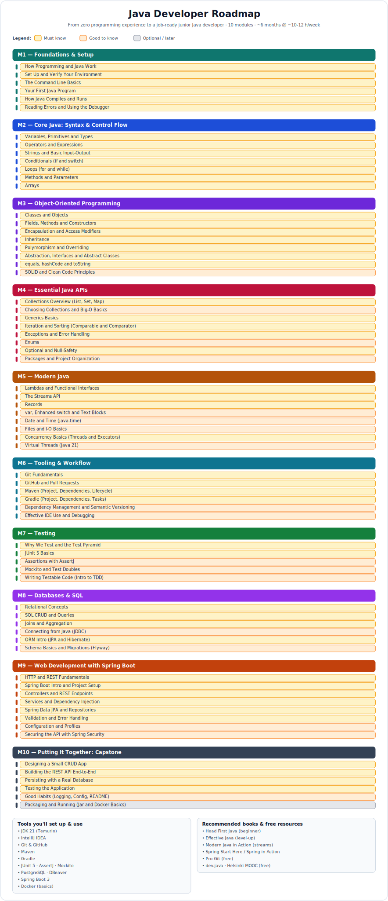

# Java Developer Roadmap

A structured, hands-on path from **zero programming experience** to a **job-ready junior Java
developer** — built as an [Obsidian](https://obsidian.md) vault you can download and work through.

It covers everything you actually need: the knowledge, the tools, and the books — organized into
**10 modules** and **68 hands-on topics**, from "what is a program" all the way to building a real
Spring Boot REST API.

## The path at a glance



> In Obsidian you can also open the interactive **`Roadmap.canvas`** to navigate straight to any topic.

1. **Foundations & Setup** — how programming and Java work; install and run your first program
2. **Core Java** — syntax, types, control flow, methods, arrays
3. **Object-Oriented Programming** — classes, inheritance, polymorphism, interfaces
4. **Essential Java APIs** — collections, generics, exceptions, enums, Optional
5. **Modern Java** — lambdas, streams, records, date/time, files, concurrency basics
6. **Tooling & Workflow** — Git, GitHub, Maven, Gradle, the IDE
7. **Testing** — JUnit 5, AssertJ, Mockito, writing testable code
8. **Databases & SQL** — SQL, JDBC, JPA/Hibernate, migrations
9. **Web Development with Spring Boot** — HTTP/REST, Spring Boot, a secured REST API
10. **Capstone** — tie it all together in a full CRUD application

Target: roughly **6 months at ~10–12 hours/week**. Go at your own pace.

## How to use this as an Obsidian vault

1. Install [Obsidian](https://obsidian.md) (free, desktop and mobile).
2. Download this repo: **Code → Download ZIP**, then unzip it — or `git clone` it.
3. In Obsidian: **Open folder as vault** → choose the downloaded `java-roadmap` folder.
4. Open **`Java Developer Roadmap - MOC.md`** — that's your home base. Bookmark it.
5. Begin with **`Tools & Setup`**, then start Module 1 and work through the topics in order.

Each topic note follows the same loop: *Learning Objectives → Learn → Concepts → Practice →
Definition of Done*. Tick the checkboxes and update each note's `status` as you progress; the
built-in Dashboard tracks everything for you.

> The Dashboard uses Obsidian's built-in **Bases**. If it doesn't render on your device, the
> **Module Index** inside the MOC gives you the same navigation.

## Repository layout

```
Java Developer Roadmap - MOC.md   Home note (start here)
_Conventions.md                   How the vault works + frontmatter rules
_Template - Topic.md              Skeleton for new topic notes
Tools & Setup.md                  Environment setup
Books & Resources.md              Recommended books and free resources
Topics/                           All 68 learning topics (M1–M10)
Dashboard.base                    Live progress dashboard (Obsidian Bases)
Roadmap.canvas                    Interactive visual map (Obsidian)
assets/                           Roadmap image and other assets
```

## License

[MIT](LICENSE) © 2026 Vadym Novakovskyi
